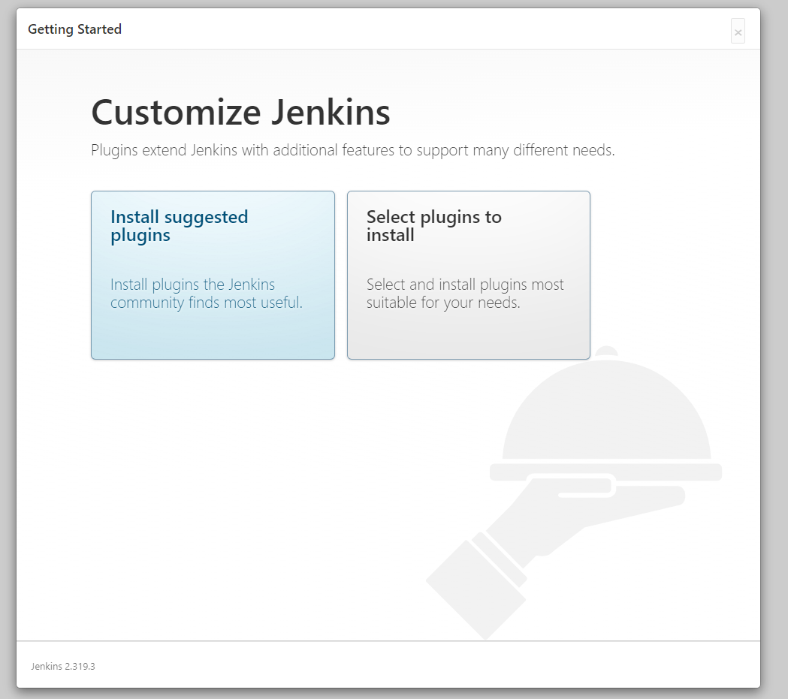
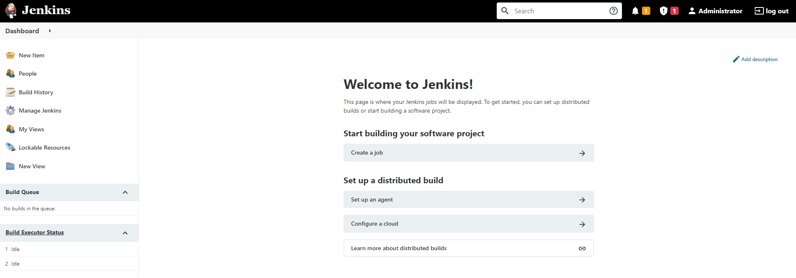
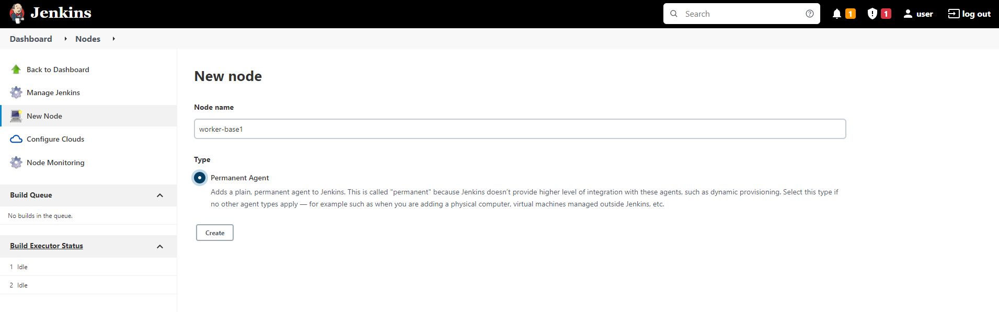
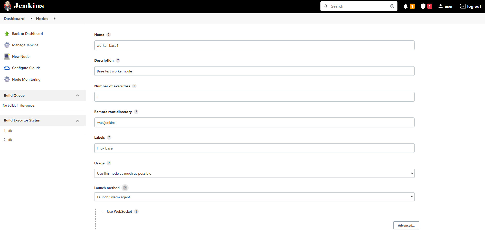
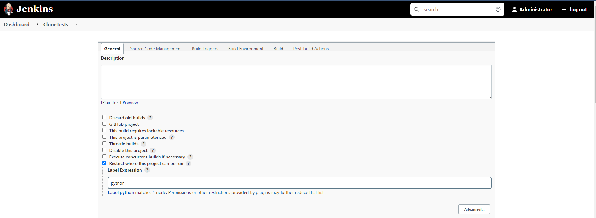
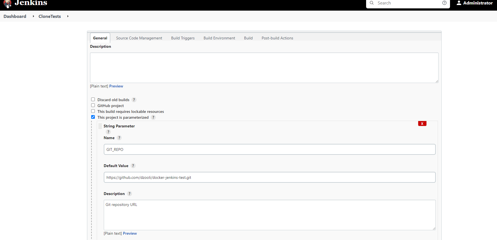

# Setting up a Jenkins playgroud

## Purpose of this document

I have created this short tutorial for anyone who wants to test, improve knowledge, try something new about Jenkins CI/CD v2. The setup contains a Jenkins server a basic worker node and a PyTest capable worker node.

## Steps to complete

1. Setup a Jenkins server node
2. Add a simple worker node
3. Add a Python capable worker node
4. Create build steps
   1. Clone test repository from GitHub
   2. Install requirements
   3. Run a simple test case with PyTest
5. Create the build pipeline
6. Run the pipeline
7. Investigate further improvement possibilities

## Requirements

- Docker Desktop installed
- Internet connection
- basic knowledge about Docker
- some understanding of Docker compose and docker-compose.yml file structure

## Used tools and Docker images

### Docker images

- jenkins/jenkins as the server
- jenkins/inbound-agent as the base of the worker nodes

### Tools

- Your favorite text editor
- A CLI utility or the embedded terminal in VS Code

## Let's start

### The Jenkins server node

We are using Docker compose to create the necessary services. First is the Jenkins server:

```yaml
version: "3"

services:
  jenkins:
    image: jenkins/jenkins:lts-jdk11 # or bitnami/jenkins:latest
    ports:
      - "8050:8080"
      - "8043:8443" # For Bitnami container using HTTPS
      # - '50000:50000' # Enable JNLP (Java Network Launch Protocol) port if you want to attach external workers using host networking
    volumes:
      - "jenkins_home:/var/jenkins_home"
      # - './server-scripts:/usr/share/jenkins/ref'
    environment:
      JENKINS_HOME: /var/jenkins_home # For Bitnami
    networks:
      - jenkins-network
```

As the JNLP port is not exposed by default we are able to reach the JNLP functionality from inside `jenkins-network` only. After starting the stack with:

```bash
docker-compose up --build
```

the server will be available on [http://localhost:8050/](https://localhost:8050/)

and we can unlock the UI by copying the administrator password appeared on the container's console. Next we could create a real admin user and initialize the plugins if necessary (recommended). If the plugin installation fails first time try it again.



After completion of the initialization we are able to add nodes and setup the enviromnent in the following way. Here is the initial dashboard of our brand new Jenkins:



### Setup the worker nodes

#### Base node

Now we are able to setup the worker nodes. Click on **Set up an agent** button then configure the first agent as you see below:





#### Python node

Like in the previous step setup another agent but add a `python` label separated by space. Also increase the 'Number of executors' value at least to 3.

### Add the worker nodes to the stack

#### Base node

Add two new sections to your `docker-compose.yml`. First for the base node:

```yaml
node1:
  build:
    context: ./nodes/base-worker
    dockerfile: Dockerfile
  environment:
    JENKINS_URL: http://jenkins:8080
    JENKINS_AGENT_NAME: worker1-base
    JENKINS_SECRET: # include your key from the Jenkins server and restart the stack - the worker should be connected to Jenkins server
  networks:
    - jenkins-network
```

Your `nodes/base-worker` directory should contain these files:

- A `Dockerfile`

  ```Dockerfile
  ARG JENKINS_AGENT_NAME
  ARG JENKINS_URL
  ARG JENKINS_SECRET
  FROM jenkinsci/jnlp-slave

  USER jenkins
  COPY --chown=jenkins:jenkins ./* .
  RUN chmod 700 ./entrypoint.sh
  ENTRYPOINT ["./entrypoint.sh"]
  ```

- And the `entrypoint.sh` - we need to wait some time before starting the agent for the complete server initialization.

  ```bash
  #!/bin/bash

  echo "Waiting for the server..."
  sleep 30
  echo "Staring the agent..."
  /usr/local/bin/jenkins-agent \
      -url ${JENKINS_URL} \
      ${JENKINS_SECRET} \
      ${JENKINS_AGENT_NAME}
  ```

#### Python node

- `docker-compose.yml` service addition
  ```
  node2:
  build:
    context: ./nodes/pytest-worker
    dockerfile: Dockerfile
  environment:
    JENKINS_URL: http://jenkins:8080
    JENKINS_AGENT_NAME: worker2-python
    JENKINS_SECRET: # insert here
  networks:
    - jenkins-network
  ```
- `Dockerfile` in `nodes/pytest-worker`

  ```Dockerfile
  ARG JENKINS_AGENT_NAME
    ARG JENKINS_URL
    ARG JENKINS_SECRET
    FROM jenkins/inbound-agent

    USER root
    RUN apt -y update && \
        apt upgrade -y && \
        apt install -y python3 python3-pip python3-venv

    USER jenkins
    COPY --chown=jenkins:jenkins ./* .
    RUN chmod 700 ./entrypoint.sh
    ENTRYPOINT ["./entrypoint.sh"]
  ```

- `entrypoint.sh` in `nodes/pytest-worker` is the same as used in the base-node

**Do not forget to insert the node secrets and node names** to the compose file. The secrets are available in Jenkins from **Dashboard => Manage Jenkins => Manage Nodes and Clouds** ([Manage Nodes page](http://localhost:8050/computer))

Restart your docker stack with all the created nodes:

```bash
docker compose up --build
```

If you experienced strange errors (like 'exec format error') and edited the files using Windows try to convert line endings to LF in the \*.sh files with the dos2unix utility.

After successful start of the stack login to the Jenkins server again. On the dashboard you will see the connected workers under the **Build Executor Status** section on the sidebar.

Now we completed the server and node setup. Let's create the build steps.

### Build step definitions

**General recommendation**: Use underscores instead of spaces or do not use spaces in the job names. Your life will be easier without spaces.

#### Clone source repository step

On the dashboard of Jenkins click the **Create a job** button and name the Job as _CloneTests_. Select **Freestyle project**.

Restrict the build for our Python-capable node by checking **Restrict where this project can be run** checkbox and selecting the **python** node from the dropdown list:



This build step should be used in a pipeline so we will to set it as parametrized build and add the parameter like this:



Configure the Git repository in the **Source Code Management** section:


In the **Build Environment** section check **Delete workspace before build starts** and save the job.

Go forward with the preparation step.

#### Create Python Virtual Environment step

Create another parametrized **Freestyle Job** named _PythonVenvInit_ similar to the previous but without source code management.

Declare the parameter name as **VENV_WORKSPACE_DIR** which should be used in the build process.

Add a build step **Execute Shell** and use this small script to create the python virtual environment and install the dependencies:

```bash
#!/bin/bash
cd ../${VENV_WORKSPACE_DIR}
python3 -m venv venv
source venv/bin/activate
pip3 install -r requirements.txt
```

#### Install dependencies step

Create the preparation step as a **Freestyle Job** named _PythonVenvTestRun_ with same parameters and also restricted to the python node with the following **Execute Shell** build step:

```bash
#!/bin/bash
cd ../$VENV_WORKSPACE_DIR
source venv/bin/activate
pytest -v
```

### Pipeline definition

In this final step we should use the previously defined building blocks to define the pipeline.

Create a new **Pipeline** job named _RunMainTests_, set it to parametrized and add two string parameters: _GIT_REPO_ and _VENV_WORKSPACE_DIR_.

In the pipeline section select **Pipeline script** and add the following snippet to the textarea:

```ruby
pipeline {
    agent {label 'python'}
    stages {
        stage('Clone') {
            steps {
                build job: 'CloneTests',
                parameters: [string(name: 'GIT_REPO', value: params.GIT_REPO)]
            }
        }
        stage ('Init') {
            steps {
                build job: 'PythonVenvInit',
                parameters: [string(name: 'VENV_WORKSPACE_DIR', value: params.VENV_WORKSPACE_DIR)]
            }
        }
        stage('Test') {
            steps {
                build job: 'PythonVenvTestRun',
                parameters: [string(name: 'VENV_WORKSPACE_DIR', value: params.VENV_WORKSPACE_DIR)]
            }
        }
    }
}
```
